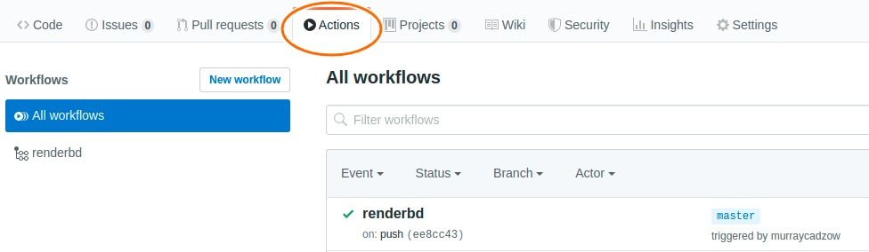
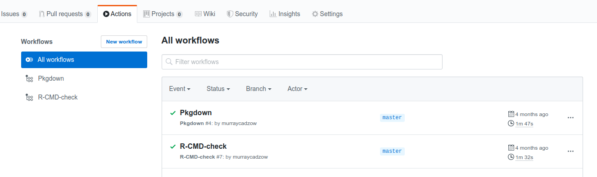
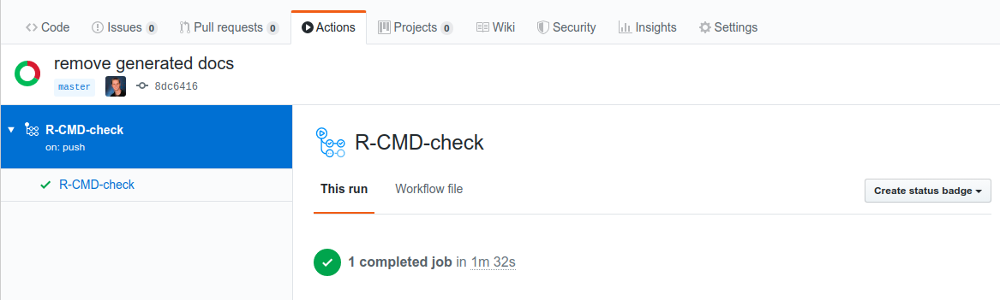
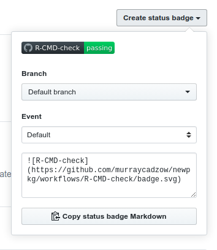

# Example workflow to set up continuous integration for packages {#packageci}


This is an example workflow to create a package and use GitHub actions to apply continuous integration (CI). 
CI automatically checks and tests packages upon a `git push`.

Wrappers to implement some GitHub actions are included in the development version of `usethis`, which can be installed from GitHub using:


```r
# install.packages("devtools")
devtools::install_github("r-lib/usethis")
```

## Set up package 

### New project, GitHub first

The CI GitHub actions require a package that is set up with git and GitHub. 
There are some useful instructions for setting up a new project in the [happygitwithr book](https://happygitwithr.com/new-GitHub-first.html#new-GitHub-first). 
After setting up the repo in this way, you'll need to add the infrastructure to turn the project into a package. 
You can do so, for example, with the following command:


```r
usethis::create_package(path = "path_to_project")
```

### Existing package with Github

Make sure that you have Git Hub set up with your package. Refer to https://happygitwithr.com/ for setting up with an existing project.

- [Existing project and package, github first](https://happygitwithr.com/existing-github-first.html#existing-github-first)

- [Existing project and package, github last](https://happygitwithr.com/existing-github-last.html#existing-github-last)

### Add Github links to DESCRIPTION

You'll need to point your package to where your GitHub instance is located. 
The following function populates the URL and BugReports fields of a GitHub-using R package DESCRIPTION file with links to GitHub. 
If your project is hosted by an enterprise GitHub server this is where you can specify that in the input arguments. 


```r
usethis::use_github_links()
```

If a new GitHub Personal Access Token (PAT) needs to be generated, `usethis` will print some instructions to the console for you to follow. 

## Actions for continuous integration checks

Both of the following functions create a yaml file in `.github/workflows/` that will trigger a CI check using GitHub actions. 
They also print the code to copy into your readme to add a badge for CI.

### CI release check


```r
usethis::use_github_action_check_release()
```

This option is the more simplified check. It only specifies checking on Mac-OSX and on the most recent version of R. 
If you are happy with these settings, no alterations to the automatically generated yaml are needed. 

### CI full check


```r
usethis::use_github_action_check_full()
```

This option sets up a more comprehensive CI check. 
It tests the package on Linux, Windows, as well as Mac-OSX operating systems. 
It also queries dependencies, caches previous installations of them, and evaluates test coverage using codecov. 
To make the file work as is, a token for codecov must be added to your secrets page. 
We explain how to this below!
If you are not interested in syncing your package to codecov, this part is not necessary. 

## Triggering actions


Now git add, commit the changes and push them to your repo and the action will run! 

On your repository you can see the what action are running under the "Actions" tab.

<!-- -->

## Did it succeed?

You can get information about the status of your github action by looking under the actions tab and once completed there will be either a green tick or red cross next to the action. By clicking on the action itself while it's running or after it's finished you can view the run logs which can be useful to understand if your action failed.

<!-- -->

Further information can be found by clicking on a particular action and there is the option to make this information displayed as a badge on your README by using the create badge button and copying the markdown code into your README.md file.

<!-- -->

<!-- -->

## What next?

Read on to Chapter \@ref(understanding-yaml) to get an introduction to the contents of the yaml files. 

